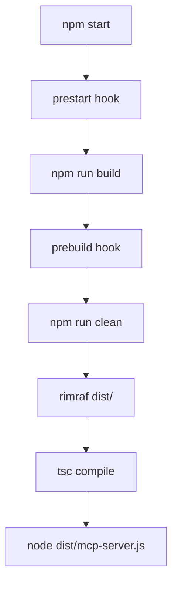

# TypeScript MCP Development Knowledge Base

A comprehensive guide for developing Model Context Protocol (MCP) servers with TypeScript, npm tooling, and debugging.

## Table of Contents
- [npm vs npx Fundamentals](#npm-vs-npx-fundamentals)
- [TypeScript Development Workflow](#typescript-development-workflow)
- [MCP Server Development](#mcp-server-development)
- [Inspector & Debugging](#inspector--debugging)
- [Troubleshooting Guide](#troubleshooting-guide)
- [Project Structure & Architecture](#project-structure--architecture)

---

## npm vs npx Fundamentals

### What is npm?
**npm** (Node Package Manager) is the package manager for Node.js that:
- Installs dependencies locally (`node_modules/`) or globally
- Manages project metadata in `package.json`
- Runs scripts defined in the `"scripts"` section
- Handles version dependencies and lockfiles

### What is npx?
**npx** (Node Package eXecute) is a package runner that:
- Executes packages without permanent installation
- Downloads packages to temporary cache if not found locally
- Always uses the latest version unless specified
- Keeps your global environment clean

### Key Differences in Practice

#### npm Commands
```bash
# Install dependencies (permanent)
npm install typescript @types/node

# Install globally (affects entire system)  
npm install -g @angular/cli

# Run project scripts from package.json
npm run build
npm run test
npm start

# Install specific version
npm install typescript@4.9.5
```

#### npx Commands
```bash
# Execute without installing (temporary)
npx typescript --version
npx create-react-app my-app

# Use specific versions without installing
npx typescript@5.0.0 --version
npx @modelcontextprotocol/inspector@latest

# Run local binaries (same as npm run)
npx tsc
npx vitest
```

### Execution Priority (npx resolution order)
1. `./node_modules/.bin/` (local project binaries)
2. Global npm installations
3. Download to npm cache (`~/.npm/_npx/`)
4. Execute from cache

### Real Example from This Project
```bash
# This command from your package.json:
"inspect:mcp": "npx @modelcontextprotocol/inspector http://localhost:${MCP_PORT:-3001}/mcp"

# What happens:
# 1. npx checks local node_modules/.bin for inspector
# 2. If not found, downloads to cache
# 3. Runs inspector with specified URL
# 4. Substitutes MCP_PORT environment variable (default 3001)
```

---

## TypeScript Development Workflow

### Project Setup & Configuration

#### Essential Files Structure
```
oncall-support/
├── package.json          # Dependencies & scripts
├── tsconfig.json         # TypeScript configuration
├── .env                  # Environment variables
├── src/                  # TypeScript source files
│   ├── mcp-server.ts     # Main server entry
│   ├── tools/            # MCP tool implementations
│   └── prompts/          # MCP prompt definitions
├── dist/                 # Compiled JavaScript output
└── test/                 # Test files & JSON-RPC samples
```

#### TypeScript Configuration (`tsconfig.json`)
Key settings for MCP development:
```json
{
  "compilerOptions": {
    "target": "ES2022",           // Modern JavaScript features
    "module": "ESNext",           // ES modules for MCP SDK
    "moduleResolution": "node",   // Node.js module resolution
    "outDir": "./dist",           // Output directory
    "rootDir": "./src",           # Source directory
    "strict": true,               # Strict type checking
    "esModuleInterop": true,      # CommonJS compatibility
    "skipLibCheck": true,         # Skip type checking of .d.ts files
    "forceConsistentCasingInFileNames": true
  },
  "include": ["src/**/*"],
  "exclude": ["dist", "node_modules"]
}
```

#### Package.json Scripts Deep Dive
```json
{
  "type": "module",              // Enable ES modules
  "scripts": {
    // Build pipeline
    "clean": "rimraf dist",                    // Clean output
    "prebuild": "npm run clean",               // Auto-runs before build
    "build": "tsc",                            // Compile TypeScript
    "prestart": "npm run build",               // Auto-builds before start
    
    // Development
    "dev": "tsx src/mcp-server.ts --transport=stdio",     // Dev with tsx (no build)
    "dev:http": "tsx src/mcp-server.ts --transport=http", // HTTP mode dev
    
    // Production
    "start": "node dist/mcp-server.js --transport=stdio", // Production STDIO
    "start:http": "node dist/mcp-server.js --transport=http", // Production HTTP
    
    // Testing & Debugging
    "inspect:mcp": "npx @modelcontextprotocol/inspector .\dist\mcp-server.js",
    "test:structure": "node test/test-prototype.js",
    
    // Code Quality
    "type-check": "tsc --noEmit",             // Check types without output
    "lint": "eslint src/**/*.ts",             // Linting
    "lint:fix": "eslint src/**/*.ts --fix"    // Auto-fix linting issues
  }
}
```

### Build Process Flow with Hooks



**Automatic Hook Execution:**
- `npm start` → `prestart` → `build` → `prebuild` → `clean` → actual commands
- This ensures fresh builds every time without manual steps

### Development vs Production Modes

#### Development with tsx (Hot Reload)
```bash
# Direct TypeScript execution (no build step)
npm run dev

# What happens:
# tsx src/mcp-server.ts --transport=stdio
# - Compiles TypeScript in memory
# - Faster iteration during development
# - No dist/ output created
```

#### Production with tsc (Compiled)
```bash
# Pre-compiled JavaScript execution
npm start

# What happens:
# 1. tsc compiles src/ → dist/
# 2. node dist/mcp-server.js --transport=stdio
# - Faster startup (pre-compiled)
# - Production-ready artifacts
```

---

## MCP Server Development

### MCP SDK Architecture

The Model Context Protocol SDK provides:
- **Server**: Hosts tools and prompts for AI clients
- **Client**: Connects to remote MCP servers 
- **Transports**: Communication layers (STDIO, HTTP, SSE)

#### Core MCP Concepts

**Tools**: Functions that AI can call
```typescript
// Tool definition
server.tool(
  'get-jira-ticket',                    // Tool name
  'Retrieve Jira ticket details',       // Description  
  {                                     // Input schema (Zod)
    ticketId: z.string().describe('Ticket key (e.g. PROJ-123)'),
    compact: z.boolean().optional()
  },
  async ({ ticketId, compact }) => {    // Handler function
    // Implementation
    return {
      content: [{ 
        type: 'text', 
        text: `Ticket ${ticketId} details...` 
      }]
    };
  }
);
```

**Prompts**: Templates that AI can request
```typescript
// Prompt definition
server.prompt(
  'customer-issue',                     // Prompt name
  'Customer issue response template',   // Description
  {                                     // Arguments schema
    ticketId: z.string(),
    customerName: z.string(),
    issueType: z.string().optional()
  },
  async ({ ticketId, customerName, issueType }) => {
    return {
      messages: [{
        role: 'user',
        content: {
          type: 'text',
          text: `Customer ${customerName} reported issue ${ticketId}...`
        }
      }]
    };
  }
);
```

### Transport Modes

#### STDIO Transport (Local)
- **Use case**: Claude Desktop, local MCP clients
- **Communication**: JSON-RPC over stdin/stdout
- **Pros**: Simple, direct connection
- **Cons**: Single client, no network access

```typescript
// STDIO server setup
const transport = new StdioServerTransport();
await server.connect(transport);
```

#### HTTP Transport (Remote) 
- **Use case**: Web clients, remote access
- **Communication**: HTTP with StreamableHTTP protocol
- **Pros**: Multiple clients, network accessible
- **Cons**: More complex setup

```typescript
// HTTP server setup  
const transport = new StreamableHTTPServerTransport({
  sessionIdGenerator: undefined // Stateless mode
});
```

### Environment Configuration

#### Essential Environment Variables
```bash
# MCP Integration
ENABLE_MCP_SERVER=false          # Enable/disable remote MCP client

# Server Configuration  
PORT=3000                        # Main server port
MCP_PORT=3001                    # MCP HTTP transport port
NODE_ENV=development             # Environment mode

# Jira Integration (Required)
JIRA_BASE_URL=https://company.atlassian.net
JIRA_USERNAME=your-email@company.com  
JIRA_API_TOKEN=your-api-token

# Security
JWT_SECRET=your-jwt-secret
CORS_ORIGIN=http://localhost:3000

# Storage
LOCAL_STORAGE_DIR=./oncall-files
STORAGE_DIR=./.mcp-storage
```

---

## Inspector & Debugging

### How npm run Works

When you run `npm run <script-name>`, npm:
1. Reads `package.json` → `"scripts"` section
2. Automatically runs `pre<script>` hooks before the main script
3. Adds `node_modules/.bin` to PATH (access to local binaries)
4. Executes the command with environment variables available

### MCP Inspector Launch Methods

#### Method 1: STDIO Mode (Recommended for Development)
```bash
# 1. Ensure project is built
npm run build

# 2. Launch inspector
npx @modelcontextprotocol/inspector .\dist\mcp-server.js
```
**Output**: Opens browser at `http://localhost:6274` with Inspector UI

#### Method 2: HTTP Mode (Remote Access)
```bash
# Terminal 1: Start MCP server in HTTP mode
npm run start:http

# Terminal 2: Launch inspector against HTTP endpoint  
npx @modelcontextprotocol/inspector http://localhost:3001/mcp
```

#### Method 3: Development Mode (No Build Required)
```bash
# Use tsx for direct TypeScript execution
npx @modelcontextprotocol/inspector <(npx tsx src/mcp-server.ts --transport=stdio)
```

### JSON-RPC Testing (Advanced)

#### Direct STDIO Testing
```bash
# Test tools listing
Get-Content .\test\test-stdio-list-tools.json | node .\dist\mcp-server.js --transport=stdio 2>$null

# Test prompts listing  
Get-Content .\test\test-stdio-list-prompts.json | node .\dist\mcp-server.js --transport=stdio 2>$null

# Test tool invocation
Get-Content .\test\test-stdio-call-mcp.json | node .\dist\mcp-server.js --transport=stdio 2>$null
```

#### Sample JSON-RPC Requests
**List Tools** (`test/test-stdio-list-tools.json`):
```json
{"jsonrpc": "2.0", "id": 1, "method": "tools/list", "params": {}}
```

**Call Tool** (`test/test-stdio-call-tool.json`):
```json
{
  "jsonrpc": "2.0", 
  "id": 2, 
  "method": "tools/call", 
  "params": {
    "name": "get-jira-ticket",
    "arguments": {"ticketId": "PROJ-123", "compact": true}
  }
}
```

---

## Project Structure & Architecture

### Directory Layout
```
oncall-support/
├── src/
│   ├── mcp-server.ts              # Main MCP server entry point
│   ├── tools/                     # MCP tool implementations
│   │   ├── jira/
│   │   │   ├── jira-service.ts    # Unified Jira operations  
│   │   │   └── types.ts           # Jira type definitions
│   │   ├── mcp/
│   │   │   ├── mcp-service.ts     # Remote MCP metadata fetching
│   │   │   └── mcp-client-connector.ts  # Remote MCP client
│   │   └── support-automation/
│   │       └── support-automation-service.ts
│   ├── prompts/
│   │   └── support.ts             # Prompt definitions
│   └── types/                     # Shared TypeScript types
├── dist/                          # Compiled JavaScript (generated)
├── test/                          # Test files & JSON-RPC samples
│   ├── test-stdio-*.json          # STDIO test requests
│   ├── test-mcp-connection.js     # Remote MCP connection test
│   └── test-prototype.js          # Structure validation
├── cache/                         # MCP metadata cache (generated)
│   ├── mcp-tools.json            # Cached remote tools
│   └── mcp-prompts.json          # Cached remote prompts
├── package.json                   # Dependencies & npm scripts
├── tsconfig.json                  # TypeScript configuration
├── .env                           # Environment variables
└── MCP_INSPECTOR_GUIDE.md        # This guide
```

### TypeScript Module Architecture

#### Server Core (`src/mcp-server.ts`)
```typescript
import { McpServer } from "@modelcontextprotocol/sdk/server/mcp.js";
import { StdioServerTransport } from "@modelcontextprotocol/sdk/server/stdio.js";

// Unified server factory - works for both transports
async function createMcpServer(): Promise<McpServer> {
  const server = new McpServer({
    name: "Oncall Support Server",
    version: "1.0.0"
  });
  
  // Register tools...
  // Register prompts...
  
  return server;
}
```

#### Tool Service Pattern (`src/tools/*/service.ts`)
```typescript
import { z } from "zod";

export const toolName = {
  name: 'tool-name',
  description: 'Tool description',
  schema: {
    param1: z.string().describe('Parameter description'),
    param2: z.boolean().optional()
  },
  handler: async (args: any) => {
    // Implementation
    return {
      content: [{ type: 'text', text: 'Result...' }]
    };
  }
};
```

#### Type Definitions (`src/types/`)
```typescript
// Shared interfaces
export interface JiraTicket {
  key: string;
  summary: string;
  status: string;
  // ...
}

export interface McpToolResponse {
  content: Array<{
    type: 'text' | 'image' | 'resource';
    text?: string;
    data?: string;
    mimeType?: string;
  }>;
  isError?: boolean;
}
```

### Dependency Management

#### Core MCP Dependencies
```json
{
  "dependencies": {
    "@modelcontextprotocol/sdk": "^1.0.0",  // MCP SDK
    "zod": "^3.22.0",                       // Schema validation
    "axios": "^1.6.0",                      // HTTP client
    "dotenv": "^16.3.1",                    // Environment variables
    "express": "^4.18.2"                   // HTTP server (for HTTP transport)
  },
  "devDependencies": {
    "typescript": "^5.0.0",                // TypeScript compiler
    "@types/node": "^20.0.0",              // Node.js types
    "tsx": "^4.0.0",                       // TypeScript executor (dev)
    "vitest": "^1.0.0",                    // Testing framework
    "rimraf": "^5.0.0"                     // Cross-platform rm -rf
  }
}
```

#### Import Patterns
```typescript
// MCP SDK imports
import { McpServer } from "@modelcontextprotocol/sdk/server/mcp.js";
import { StdioServerTransport } from "@modelcontextprotocol/sdk/server/stdio.js";
import { Client } from "@modelcontextprotocol/sdk/client/index.js";

// Schema validation
import { z } from "zod";

// Type-only imports (no runtime cost)
import type { Request, Response } from 'express';
```

---

## Advanced Development Patterns

### Error Handling Strategy

#### MCP Tool Error Responses
```typescript
async function toolHandler(args: any) {
  try {
    const result = await someOperation(args);
    return {
      content: [{ type: 'text', text: JSON.stringify(result, null, 2) }]
    };
  } catch (error: any) {
    return {
      content: [{
        type: 'text',
        text: `Error: ${error.message}\n\nPlease check your input and try again.`
      }],
      isError: true  // Indicates error to MCP client
    };
  }
}
```

#### Logging in MCP Servers
```typescript
// ⚠️ CRITICAL: Never use console.log/error in STDIO mode
// STDIO uses stderr for JSON-RPC communication

// Safe logging pattern:
function safeLog(message: string) {
  const isStdio = process.argv.includes('--transport=stdio') || 
                  !process.argv.includes('--transport');
  
  if (!isStdio) {
    console.error(message);  // Only log in HTTP mode
  }
  // In production, write to log files instead
}
```

### Remote MCP Integration

#### Client Configuration (`mcp.json`)
```json
{
  "servers": {
    "atlassian-mcp-server": {
      "url": "https://mcp.atlassian.com/v1/sse",
      "type": "http",
      "headers": {
        "Authorization": "Bearer YOUR_TOKEN"
      }
    }
  },
  "inputs": []
}
```

#### Dynamic Tool Registration
```typescript
// Register remote tools as local proxies
const remoteTools = await fetchRemoteTools();
for (const tool of remoteTools) {
  server.tool(
    `remote-${tool.name}`,           // Prefix to avoid conflicts
    tool.description,
    tool.inputSchema,
    async (args: any) => {
      return await callRemoteTool(tool.name, args);
    }
  );
}
```

---

## Running MCP Inspector

### Method 1: Direct Inspector Launch (Recommended)

```bash
# 1. Build the project
npm run build

# 2. Launch inspector with STDIO transport
npx @modelcontextprotocol/inspector .\dist\mcp-server.js
```

**Result**: Opens browser at `http://localhost:6274` with MCP Inspector UI

---

### Method 2: HTTP Mode (For Remote Testing)

```bash
# Terminal 1: Start HTTP server
npm run start:http

# Terminal 2: Launch inspector
npx @modelcontextprotocol/inspector http://localhost:3001/mcp
```

---

## Troubleshooting Guide

### ❌ Error: "PORT IS IN USE at port 6277"

**Cause**: Previous inspector instance still running

**Solution**:
```powershell
# Option 1: Find and kill the process
Get-Process node | Stop-Process -Force

# Option 2: Check what's using the port
netstat -ano | findstr :6277
# Then kill the specific PID
taskkill /F /PID <PID>

# Option 3: Restart inspector
npx @modelcontextprotocol/inspector .\dist\mcp-server.js
```

---

### ❌ Error: "Cannot find module" or Import Errors

**Cause**: Project not built or dependencies missing

**Solution**:
```bash
# Rebuild everything
npm run build

# If that fails, reinstall dependencies
npm install
npm run build
```

---

### ❌ Error: "tsc: command not found"

**Cause**: TypeScript not installed

**Solution**:
```bash
npm install
```

---

### ❌ Inspector Opens but Shows No Tools

**Possible Causes**:

1. **Build is stale**
   ```bash
   npm run build
   npx @modelcontextprotocol/inspector .\dist\mcp-server.js
   ```

2. **STDIO communication error** (console.error logs interfering)
   - Check that `src/mcp-server.ts` doesn't have console.error in STDIO mode
   - All console.error calls in STDIO mode should be conditional

3. **Server crashed on startup**
   ```bash
   # Test the server directly
   node .\dist\mcp-server.js --transport=stdio < test\test-stdio-list-tools.json
   ```

---

### ❌ Error: "SyntaxError: Unexpected token" in STDIO

**Cause**: Console logging interfering with JSON-RPC protocol

**Solution**: Ensure no `console.log` or `console.error` statements run in STDIO mode
- STDIO uses stderr for JSON-RPC communication
- Any logging to stderr corrupts the protocol

---

### ❌ Remote MCP Connection Fails (401 Unauthorized)

**Cause**: Atlassian MCP server requires authentication

**Status**: Remote MCP integration currently disabled (`ENABLE_MCP_SERVER=false` in `.env`)

**To Enable**:
1. Get authentication token from Atlassian
2. Update `mcp.json`:
   ```json
   {
     "servers": {
       "atlassian-mcp-server": {
         "url": "https://mcp.atlassian.com/v1/sse",
         "type": "http",
         "headers": {
           "Authorization": "Bearer YOUR_TOKEN"
         }
       }
     }
   }
   ```
3. Set `ENABLE_MCP_SERVER=true` in `.env`

---

## Testing Without Inspector

### Test Tools Listing

```powershell
# List all available tools
Get-Content .\test\test-stdio-list-tools.json | node .\dist\mcp-server.js --transport=stdio 2>$null
```

Expected output: JSON with 11 tools

### Test Prompts Listing

```powershell
# List all available prompts  
Get-Content .\test\test-stdio-list-prompts.json | node .\dist\mcp-server.js --transport=stdio 2>$null
```

Expected output: JSON with 5 prompts

---

## Current Tool Inventory

When working correctly, the inspector should show **11 tools**:

### Jira Tools (7)
1. `get-jira-ticket` - Get ticket details
2. `search-jira-tickets` - JQL search
3. `add-jira-comment` - Add comment to ticket
4. `update-jira-fields` - Update ticket fields
5. `transition-jira-ticket` - Change ticket status
6. `get-jira-transitions` - List available transitions
7. `get-jira-field-options` - Get field allowed values

### Support Automation Tools (3)
8. `ticket-analysis` - Analyze tickets (root cause, impact, timeline)
9. `knowledge-search` - Search knowledge base
10. `ticket-triage` - Auto-triage with recommendations

### MCP Tools (1)
11. `list-mcp-metadata` - List remote MCP server tools/prompts (when enabled)

### Prompts (5)
1. `customer-issue` - Customer issue template
2. `troubleshooting-guide` - Troubleshooting template
3. `customer-communication` - Communication template
4. `escalation-template` - Escalation template
5. `knowledge-base-article` - KB article template

---

## Quick Diagnostic Commands

```bash
# Check if server compiles
npm run build

# Check if server runs
node .\dist\mcp-server.js --transport=stdio

# Check TypeScript errors
npm run type-check

# Test remote MCP connection (shows auth status)
node test/test-mcp-connection.js

# Full rebuild
npm run clean && npm install && npm run build
```

---

## Environment Configuration

Check `.env` file for:
```properties
# MCP Integration (currently disabled)
ENABLE_MCP_SERVER=false

# Server ports
PORT=3000
MCP_PORT=3001

# Jira credentials (required)
JIRA_BASE_URL=https://caseware.atlassian.net
JIRA_USERNAME=your-email@company.com
JIRA_API_TOKEN=your-api-token
```

---

## Development Workflow

```bash
# 1. Make changes to TypeScript files in src/

# 2. Rebuild
npm run build

# 3. Test with inspector
npx @modelcontextprotocol/inspector .\dist\mcp-server.js

# 4. Or test programmatically
node test/test-mcp-connection.js
```

---

### Performance Optimization

#### Build Performance
```bash
# Faster builds with incremental compilation
npm run type-check     # Check types only (no output)
npx tsc --incremental  # Incremental compilation

# Faster development with tsx
npm run dev            # Skip build step entirely
```

#### Runtime Performance  
```typescript
// Lazy loading of heavy dependencies
const loadJiraClient = async () => {
  const { JiraApi } = await import('jira-client');
  return new JiraApi(config);
};

// Connection pooling for HTTP clients
const axiosInstance = axios.create({
  timeout: 10000,
  maxRedirects: 3
});
```

### Testing & Quality Assurance

#### Unit Testing with Vitest
```typescript
// test/tools/jira.test.ts
import { describe, it, expect } from 'vitest';
import { jiraService } from '../../src/tools/jira/jira-service.js';

describe('Jira Service', () => {
  it('should format ticket response', async () => {
    const result = await jiraService.getTicket.handler({
      ticketId: 'TEST-123'
    });
    
    expect(result.content).toBeDefined();
    expect(result.content[0].type).toBe('text');
  });
});
```

#### Integration Testing
```bash
# Test MCP server directly
npm run test:structure

# Test specific tools
node test/jira-integration.test.mjs

# Test remote connections
node test/test-mcp-connection.js
```

#### Type Checking Pipeline
```bash
# Continuous type checking
npm run type-check

# Watch mode for development
npx tsc --watch --noEmit
```

---

## Production Deployment

### Docker Configuration
```dockerfile
# Dockerfile
FROM node:18-alpine

WORKDIR /app
COPY package*.json ./
RUN npm ci --only=production

COPY dist/ ./dist/
COPY .env ./

EXPOSE 3001
CMD ["npm", "run", "start:http"]
```

### Environment-Specific Configs
```bash
# Development
NODE_ENV=development
ENABLE_MCP_SERVER=false

# Staging  
NODE_ENV=staging
ENABLE_MCP_SERVER=true
MCP_PORT=3001

# Production
NODE_ENV=production
ENABLE_MCP_SERVER=true
MCP_PORT=80
```

### Health Checks & Monitoring
```typescript
// Health endpoint for HTTP mode
app.get('/health', (req, res) => {
  res.json({ 
    status: 'healthy',
    tools: server.listTools().length,
    uptime: process.uptime(),
    memory: process.memoryUsage()
  });
});
```

---

## Best Practices & Conventions

### Code Organization
- **One tool per file** in `src/tools/domain/`
- **Shared types** in `src/types/`
- **Environment-specific** configs in `.env` files
- **Test files** mirror source structure

### Naming Conventions
```typescript
// Tool names: kebab-case
'get-jira-ticket'
'search-tickets'

// File names: kebab-case  
jira-service.ts
mcp-client-connector.ts

// TypeScript: PascalCase for types, camelCase for functions
interface JiraTicket {}
function formatTicketResponse() {}
```

### Security Guidelines
- **Never commit** `.env` files with secrets
- **Validate all inputs** with Zod schemas  
- **Sanitize outputs** before returning to MCP client
- **Use environment variables** for configuration

### Error Handling Standards
```typescript
// Standard error response format
return {
  content: [{
    type: 'text',
    text: `❌ Error: ${error.message}\n\n🔧 Suggestion: ${suggestion}`
  }],
  isError: true
};
```

---

## Quick Reference

### Essential Commands
```bash
# Development workflow
npm install              # Install dependencies
npm run build           # Compile TypeScript
npm run dev             # Development mode (no build)
npm start               # Production mode (STDIO)
npm run start:http      # Production mode (HTTP)

# Testing & debugging
npx @modelcontextprotocol/inspector .\dist\mcp-server.js
npm run test:structure  # Test project structure
npm run type-check      # TypeScript validation

# Maintenance  
npm run clean           # Remove dist/
npm run lint            # Code linting
npm run lint:fix        # Auto-fix linting issues
```

### File Locations
- **Source**: `src/mcp-server.ts`
- **Compiled**: `dist/mcp-server.js`  
- **Config**: `tsconfig.json`, `.env`
- **Tests**: `test/test-stdio-*.json`
- **Docs**: `MCP_INSPECTOR_GUIDE.md`, `README.md`

### Port Usage
- **3000**: Main server port
- **3001**: MCP HTTP transport port  
- **6274**: MCP Inspector web UI
- **6277**: MCP Inspector proxy server

---

## Troubleshooting Reference

### Build Issues
```bash
# Clean rebuild
npm run clean && npm install && npm run build

# Check TypeScript errors
npm run type-check

# Verify dependencies
npm ls --depth=0
```

### Runtime Issues  
```bash
# Test server startup
node .\dist\mcp-server.js --transport=stdio

# Check environment
echo $NODE_ENV
cat .env | grep ENABLE_MCP_SERVER

# Validate JSON-RPC
Get-Content .\test\test-stdio-list-tools.json | node .\dist\mcp-server.js --transport=stdio
```

### Inspector Issues
```bash
# Kill existing processes
Get-Process node | Stop-Process -Force

# Check port availability
netstat -ano | findstr :6277
netstat -ano | findstr :6274

# Fresh inspector launch
npx @modelcontextprotocol/inspector .\dist\mcp-server.js
```

---

## Additional Resources

### Documentation
- **MCP Protocol Spec**: https://spec.modelcontextprotocol.io/
- **MCP SDK Documentation**: https://github.com/modelcontextprotocol/typescript-sdk
- **TypeScript Handbook**: https://www.typescriptlang.org/docs/
- **Zod Documentation**: https://zod.dev/

### Tools & Utilities
- **MCP Inspector**: https://github.com/modelcontextprotocol/inspector
- **TypeScript Playground**: https://www.typescriptlang.org/play
- **npm Documentation**: https://docs.npmjs.com/

### Community
- **MCP GitHub**: https://github.com/modelcontextprotocol
- **TypeScript Community**: https://github.com/microsoft/TypeScript
- **Node.js Documentation**: https://nodejs.org/docs/

### Project Files
- **Main README**: `./README.md`
- **API Documentation**: Generated from JSDoc comments
- **Change Log**: Track in version control commits
